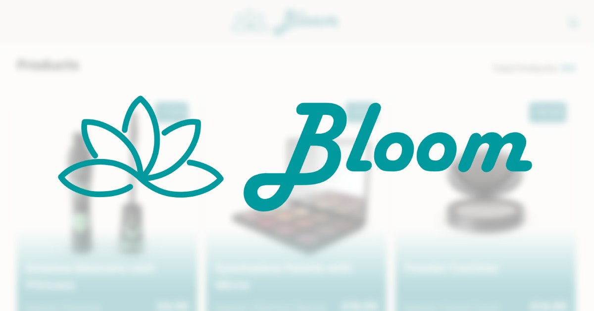

# Bloom | Shopping Cart Application | Tangent <!-- omit from toc -->

This is a simple shopping cart application built using React, TypeScript, and Vite that was done as a task for [Tangent](https://tangent.co/). Bloom, Where Your Style Blossoms. Sustainable style for every you. Vibrant colors, unique designs, effortless confidence. Shop the new season and let your style bloom.



## Table of Content <!-- omit from toc -->

- [Getting Started](#getting-started)
- [Features](#features)
- [Extra Miles](#extra-miles)
- [Enhancements To Consider](#enhancements-to-consider)
- [Technologies Used](#technologies-used)
- [Links](#links)
- [Git Convention](#git-convention)

## Getting Started

1. First you need to make sure you have the correct version of Node.js installed. Then, you can install the dependencies using `npm` or `yarn`.
   This project contains a `.nvmrc` with the node version, so if you're using `nvm` all you need to do is run

   ```shell
   nvm use
   ```

   and if you don't have that version installed just run

   ```shell
   nvm install
   ```

   If you're not using `nvm` you need to make sure you have node installed and the version should be v21.6.1+.

2. Then run

   ```shell
   npm install
   ```

3. Finally, run

   ```shell
   npm run dev
   ```

   for booting up the development server, or

   ```shell
   npm run build
   ```

   to build the production bundle.

## Features

- A products listing page that displays a list of products.
- A product card component that displays details of a product.
- A cart button that allows users to add products to their cart.
- A cart content component that displays the line items in the cart.
- A cart line item component that displays details of a line item in the cart.
- A cart line item quantity updater component that allows users to update the quantity of a line item in the cart.
- A footer component that displays information about the application.
- A toast component that displays notifications to the user.
- Remove product from cart when quantity is below the minimum order quantity.
- Adds the minimum order quantity to the cart if the quantity is less than the minimum order quantity.
- Switches the add to cart button into increment and decrement if item is in cart already with live cart update.
- Fetch products data from the dummy-json website.

## Extra Miles

- Everything is documented using JSDoc comments.
- Unit tests are introduced, although I didn't write a lot of tests for the sake of time.
- Used typescript and made sure everything is typed properly.
- Implemented a small design token system where I have global variables in CSS to use everywhere.
- Added Micro-data attributes for better SEO, although it's a CSR app so SEO isn't the point of the project.
- Added Open graph tags for better SEO, although it's a CSR app so SEO isn't the point of the project.
- Used Mock service worker to mock the requests while testing.
- Introduced Storybook stories for most components.
- Deployed the Storybook library to Chromatic.
- Deployed the website to Netlify, and Github Pages.
- Introduced cursor paginator logic using the API provided by the dummy-json website.
- Introduced loading skeletons to show a loading placeholder while fetching any of the pages.
- Implemented a design that I created myself. I was checking something regarding UI/UX and did a small task a week ago, it was similar to what was asked in this task, so I got inspired by it. You can check the design file here: [Bloom.xd](./public/Bloom.xd).
- Save the user's cart in the storage to make it persistent.
- Introduced a Toast component that displays notifications to the user, although it's only being used for errors in this application, so it might not appear in the final product, unless something is broken.
- Introduced a Sheet component that is a dialog-like element and implemented a focus trap for it.

## Enhancements To Consider

- Introduce some state management solution like Zustand to subscribe to specific changes in state because currently context rerenders the components whenever any of the states change. I moved the state down as much as I can so that this is not a problem for now.
- Use something like Tanstack query to handle the infinite query pagination part while caching it properly in memory as currently it's not being cached at all.
- Add some animations to the application, specifically in the Sheet component.
- Add an intersection observer to implement infinite scrolling and the user wouldn't have to click the load more button any more.
- Introduce some kind of an end-to-end type safety solution, or use zod to validate the input and output of the API.
- Use github Pull Requests system instead of directly pushing to the main branch.
- Add more unit tests.
- Add more stories.

## Technologies Used

- [React](https://react.dev/) - A library for building user interfaces. _(required)_
- [Typescript](https://www.typescriptlang.org/) - A superset of JavaScript that adds type annotations to the code.
- [Vite](https://vitejs.dev/) - A bundler for modern web development. I used Vite because webpack as too much for this simple project and Vite is faster. I didn't use Parcel because the Vite API is less limiting that Parcel's.
- [Vitest](https://vitest.dev/) - A testing framework for JavaScript. Because I used Vite, I stuck with Vitest to get out-of-the-box seamless integration, also because Vitest is one of the fastest in the market.
- [React Testing Library](https://testing-library.com/docs/react-testing-library/intro/) - A testing library for React.
- [Storybook](https://storybook.js.org/) - A frontend workshop for building UI components and pages in isolation. I used it to build the base components in isolation and the used these components later like Lego blocks to build the final product.
- [clsx](https://www.npmjs.com/package/clsx) - A utility library for class names. It's a very minimal library and I used it to make it easier to merge classes together.
- [Phosphor Icons](https://phosphoricons.com/) - A library for using icons in React.
- [msw](https://mswjs.io/) - A mock service worker for testing.
- [Metatags.io](https://metatags.io/) - A tool for generating meta tags for SEO.
- [Favicon Generator](https://realfavicongenerator.net/) - A tool for generating favicons.

## Links

- Github Pages: <https://karimshalapy.github.io/bloom/>
- Netlify: <https://tangent-bloom,netlify.app/>
- Chromatic Library: <https://www.chromatic.com/library?appId=66575276813412991c16a5b9&branch=main>
- Storybook Library: <https://main--66575276813412991c16a5b9.chromatic.com/>

## Git Convention

This project follows the
[Conventional Commits](https://www.conventionalcommits.org/en/v1.0.0/) standard

```plaintext
<type>[optional scope]: <description>

[optional body]

[optional footer(s)]
```

for commit messages. The allowed types are:

- `feat`: A new feature for the user.
- `fix`: A bug fix for the user.
- `docs`: Documentation changes.
- `style`: Code style changes (formatting, indentation).
- `refactor`: Code changes that neither fix a bug nor add a feature.
- `perf`: Code changes that improve performance.
- `build`: Changes related to the build system or external dependencies.
- `ci`: Changes to the project's Continuous Integration configuration.
- `chore`: Routine tasks, maintenance, or housekeeping.
- `revert`: Reverting a previous commit.
- `test`: Adding or modifying tests.

For more information, refer to
[Conventional Commits](https://www.conventionalcommits.org/en/v1.0.0/).
